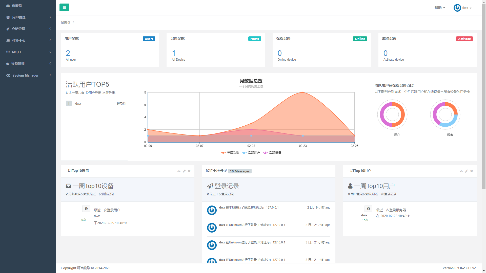
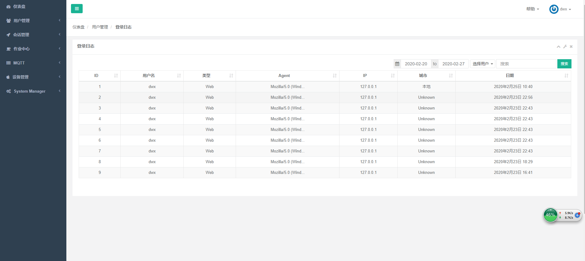
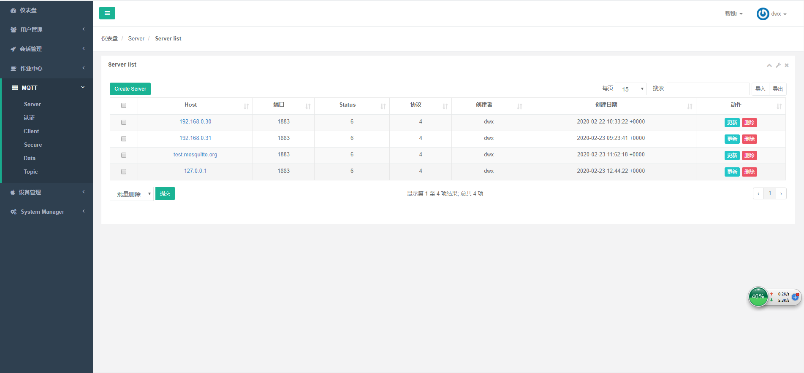
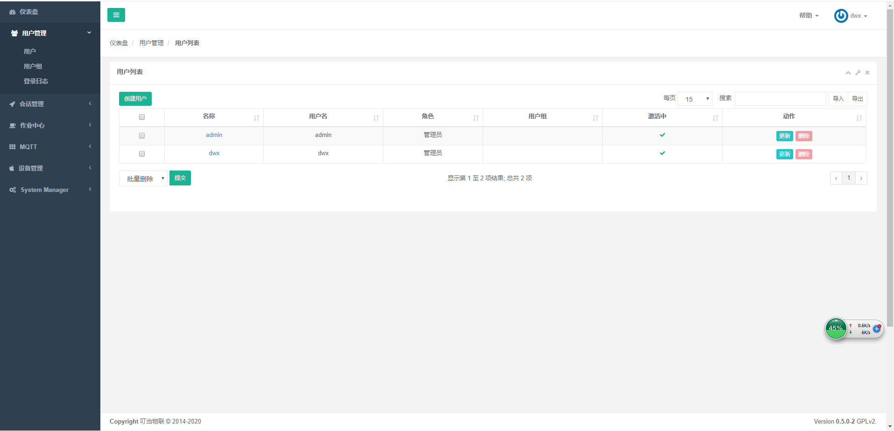
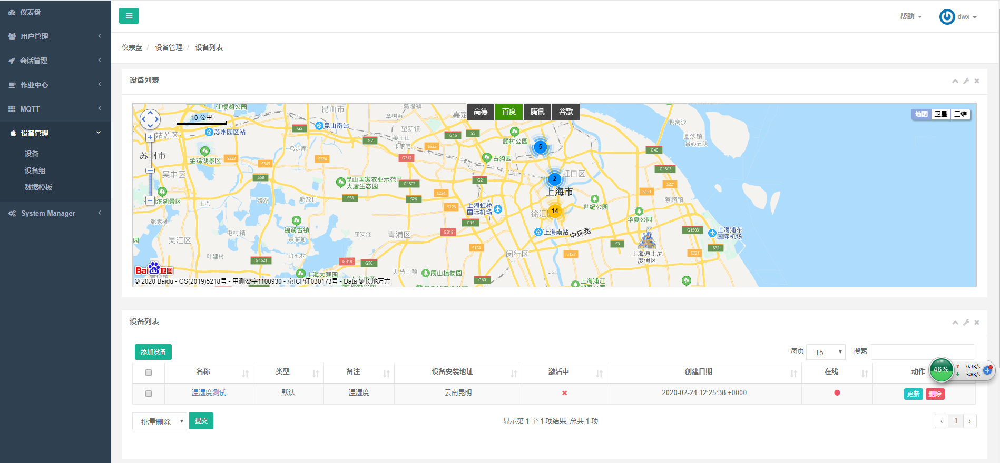
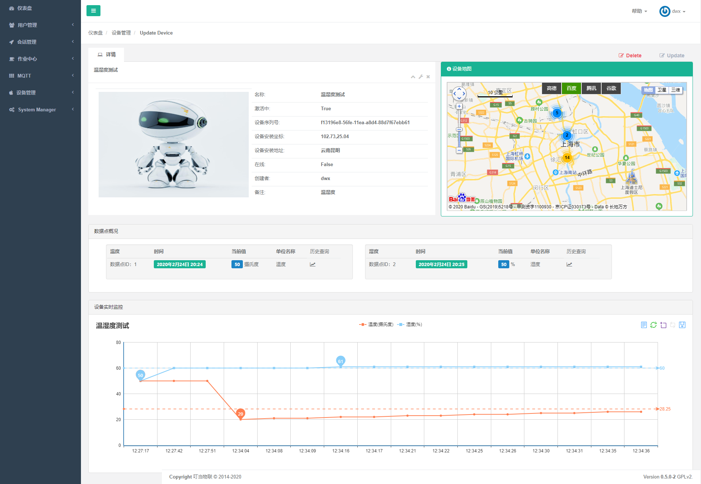
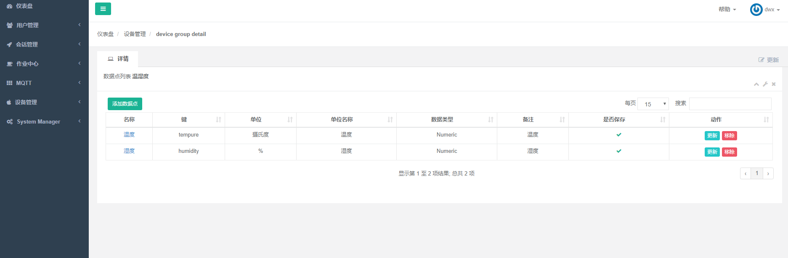

## iotserver

[](https://www.python.org/)
[](https://www.djangoproject.com/)

Iotserver是一款使用Python, Django开发的物联网系统, 助力物联网企业快速、高效的部署你的应用。

### Feature 功能
  - Auth 统一认证
  - Perm 统一授权
  - 设备分组管理
  - GPS
  - 动态显示
  - MQTT Client
  - MQTT Server
  - 支持谷歌地图
  - 支持百度地图
  - 支持腾讯地图

### Environment 环境
   * Python 3.6
   * Django 1.11

### 快速启动

```
cd apps
python manager.py runserver
```

## 联系方式
 - 邮箱：<dwxdyx@qq.com>(本项目相关或物联网相关问题请走issue流程，否则恕不邮件答复)
 - QQ群：560497341
 - blog: <a href="www.ddsiot.cn" target="_blank" >叮当物联(www.ddsiot.cn)<a>

##

### Demo

demo使用了开发者模式，并发只能为1

- iotserver: [访问](http://demo.ddsiot.cn:8080)  账号: admin 密码: admin

### 截图















### 参考
<a href="https://github.com/jumpserver/jumpserver" target="_blank">Jumpserver</a>


